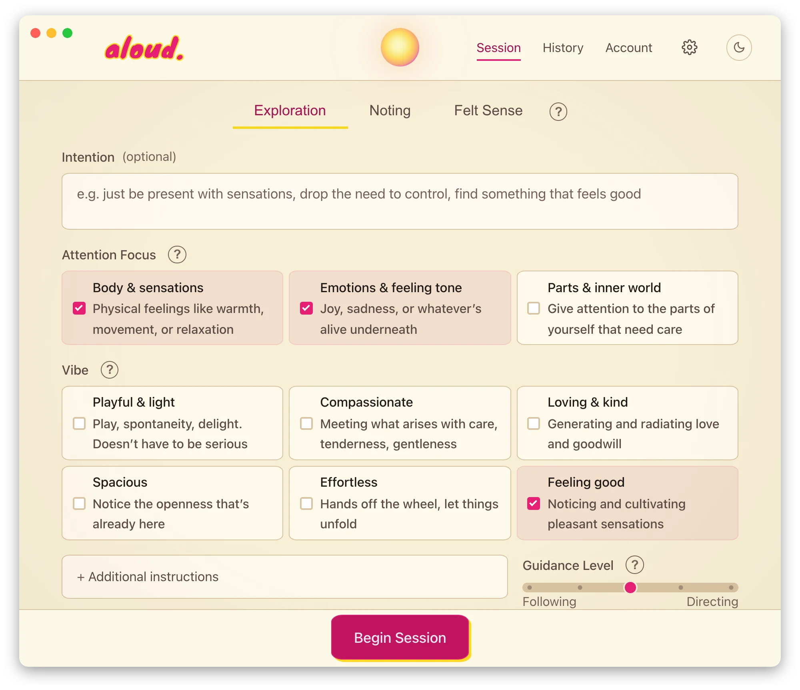

# aloud.

your voice is an overpowered and underrated tool for meditation and inner work.

**aloud.** is a meditation facilitator that listens and responds to your voice. it can be a partner for somatic exploration, parts work, felt sense work, and spaced noting. it uses your mic for voice input, whisper.cpp for speech recognition, an LLM to guide you, and speaks using text-to-speech.

aloud works in your browser and on macOS, Linux, and Windows. choose your LLM — run fully local and private with ollama, use a claude subscription (may draw from extra-use), or connect any API provider (anthropic, openai, openrouter, venice, groq). all providers are configurable from the settings page. the app will also help you set up text-to-speech if necessary.

### try it in your browser

no install needed: open [aloud.rest/app](https://aloud.rest/app) and start. the hosted web app runs on **aloud cloud**, a managed service that handles the AI for you, so there's nothing to set up. sign in with google, apple, or email to get free starter credits, then top up if you'd like to keep going. prefer your own keys? switch on bring-your-own-key in settings. the downloadable app below stays fully local and free.

<picture>
  <source media="(prefers-color-scheme: dark)" srcset="docs/assets/aloud-screen-dark.webp">
  
</picture>

## what it does

aloud has three modes: exploration, noting, and felt sense.

**exploration**: this is a dyadic meditation format where the meditator speaks about what they are experiencing in the moment and the facilitator asks brief questions to help the meditator explore. 

in this mode, you optionally set an intention and then mix and match **attention focuses** (body, emotions, parts work) with **vibes** (playful, compassionate, loving, spacious, effortless, feel-good). presets give you quick starting points, or you can build your own style. there's a directiveness slider so you can dial in how much guidance you want. in my personal experience, this sort of exploration has been helpful in experiencing jhana states if approached with enough openheartedness.

thanks to [Maija Haavisto](https://lovingawakening.net/) and [Jhourney](https://www.jhourney.io/) for guiding me in similar practices.

**noting**: you specify what participants you'd like, if any — AIs, fixed phrases, or sound effects. then starting with you, each participant notes a sensation in their "awareness" (ideally 1–2 words) or plays their fixed phrase or sound. yes, AIs noting their experience seems kind of silly, but I've actually found it helpful to observe the mental and somatic processes that happen in the cycle of resting -> hearing my cue -> observing -> speaking. if there are no other participants, it'll just briefly introduce the method and then record what you note.

thanks to [Vince Horn](https://www.buddhistgeeks.org/) and again to [Jhourney](https://www.jhourney.io/) for inspiration.

**felt sense**: a guided arc inspired by Eugene Gendlin's focusing. you start by settling and noticing what's between you and feeling fine, pick one thing, and sense how the whole of it sits in your body - vague and hard to describe is exactly right. then you let a word or image come that fits it, check it against the body-feel, ask into it, and receive whatever comes. the facilitator says very little and moves through the stages at your pace; long silences usually mean it's working.

inspired by [Gendlin's Focusing](https://focusing.org/) and Ann Weiser Cornell's inner relationship focusing.

## getting started

### download the app

grab the latest release for your platform below, or from [releases](https://github.com/akrusz/aloud/releases):

| platform | download |
|----------|----------|
| **macOS** | [`aloud_2.0.0_aarch64.dmg`](https://github.com/akrusz/aloud/releases/download/v2.0.0/aloud_2.0.0_aarch64.dmg) — open the DMG, drag aloud to Applications |
| **Windows** | [`aloud_2.0.0_x64-setup.exe`](https://github.com/akrusz/aloud/releases/download/v2.0.0/aloud_2.0.0_x64-setup.exe) — run the installer |
| **Linux** | [`aloud_2.0.0_amd64.AppImage`](https://github.com/akrusz/aloud/releases/download/v2.0.0/aloud_2.0.0_amd64.AppImage) — `chmod +x`, double-click or run from terminal |

all settings (LLM provider, voice, whisper model, display) are configurable from the settings page inside the app. whisper models download automatically on first launch. the app checks for updates on startup and will prompt you when a new version is available.

### platform notes

- **macOS**: TTS can use the `say` command with access to all system voices. You can download better system voices by going to System Settings > Accessibility > Spoken Content, click the dropdown next to System Voice, select Manage Voices, and download Enhanced or Premium voices.
- **windows**: if using browser mode, for best voice quality use Edge — it has access to Microsoft's natural voices (Ava, Jenny) through speechSynthesis.
- **linux**: your system probably doesn't have text-to-speech built in. I recommend installing piper-tts - you can do this directly on the settings page unless you're using something like Nix. otherwise TTS falls back to browser speechSynthesis. Note that some browsers don't have built in speech synthesis.

### claude subscription notes

to use the **Anthropic (Subscription)** provider, install the Claude Code CLI first, then run `claude` once in a terminal to log in with your subscription — aloud shells out to the local `claude` command to route through your account, so no API key is needed. in my testing, this did *not* draw from extra-use credits, but there have been communications from Anthropic to the effect that it would do so. also note that extra-use credits on your Claude subscription are not the same as API credits; if you only have one or the other, be sure to use the appropriate provider setting.

## tips

- if speech recognition feels slow, try the `base` whisper model (faster, less accurate).
- say something like "hold on a bit" during a session to enter silence mode. say "come back" or similar to resume.
- say "mute" to immediately turn off the microphone. click the mic button to resume.
- click the orb in the nav bar to enter kasina gazing mode during a session. click away from it to exit.
- the ember controls add floating particles. each level doubles the count and increases the size.
- click the voice name in the controls bar to open a voice/speed picker.
- sessions auto-save as JSON and plain text, with a short LLM-generated summary.
- you can continue any past session or access the saved sessions folder from the history page.
- the AI can hold silence when requested - the orb dims when it's doing so. just ask it to come back when you want it to speak.
- the AI gently checks in if you're quiet for a while. adjust timing or disable in settings.
- one running copy of aloud can be made accessible to anyone on your local network by setting network access mode to "LAN Access" in settings
- 🥚 there are a few easter eggs 🥚

## running from source

aloud is a TypeScript + Rust app. you need [Node.js](https://nodejs.org) (18+) and, for the desktop shell, the [Rust toolchain](https://rustup.rs) plus the [Tauri prerequisites](https://tauri.app/start/prerequisites/).

```bash
git clone https://github.com/akrusz/aloud.git
cd aloud/ts
npm install
npm run tauri:dev      # desktop app (Tauri shell + web UI)
```

configure your LLM provider and other settings in the app. for the browser-only dev preview and the full developer reference (ports, tests, releasing), see [dev-docs/dev-cheatsheet.md](dev-docs/dev-cheatsheet.md).

## building

release builds are automated via GitHub Actions — creating a release tagged `vX.X.X` triggers builds for all three platforms and attaches the artifacts. see [dev-docs/desktop.md](dev-docs/desktop.md) for the Tauri build and signing flow.
